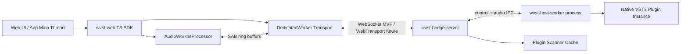

# WVST 程序模块设计

调研日期：2026-06-01

## 总体架构



核心原则：

- WebAudio 实时线程永不等待本地 VST 返回。
- Bridge Server 不加载第三方 VST。
- VST worker 是隔离边界，也是崩溃恢复边界。
- Web UI 拥有挂载、参数控制和 generic UI；本地只提供 metadata 和 processing。
- 所有模块先按 macOS MVP 落地，但接口不写死 macOS。

## 建议目录结构

```text
crates/
  wvst-core/             # 通用类型、错误、时间、sample frame、plugin id
  wvst-protocol/         # 控制面 schema、二进制音频帧、版本协商
  wvst-ringbuf/          # no_std-friendly SPSC ring buffer 和 cursor
  wvst-bridge-server/    # 独立 Bridge Server daemon
  wvst-embed/            # 可嵌入 BridgeRuntime API
  wvst-transport/        # WebSocket/WebTransport/native IPC 抽象
  wvst-process/          # worker supervisor、watchdog、platform process
  wvst-scanner/          # VST3 扫描、cache、路径 backend
  wvst-host-worker/      # worker 可执行文件入口
  wvst-vst3-host/        # VST3 ABI/host facade，unsafe 边界
  wvst-testkit/          # fake plugin、latency harness、protocol fixtures
packages/
  wvst-web/              # TS SDK、AudioWorklet、Worker、Rollup 打包
  wvst-web-wasm/         # Rust -> WASM 包装与 wasm-bindgen 输出
examples/
  web-basic-effect/
  web-instrument-midi/
  embedded-bridge/
```

## 本地模块

### `wvst-core`

职责：

- 定义 `PluginId`、`InstanceId`、`StreamId`、`SampleRate`、`BlockSize`、`ChannelLayout`、`FrameTime`。
- 定义统一错误类型和错误码。
- 不依赖 async runtime，不引入平台代码。

### `wvst-protocol`

职责：

- 控制面使用稳定 schema：JSON 或 MessagePack 均可，MVP 可 JSON，需版本字段。
- 音频数据面使用固定二进制帧，避免 JSON 和字符串解析。
- 提供 Rust 与 TS/WASM 共用的 schema fixtures。

音频帧建议：

```text
AudioFrameHeader
  magic: u32 = 'WVST'
  version: u16
  header_len: u16
  stream_id: u64
  sequence: u64
  sample_rate: u32
  frames: u16
  channels: u16
  format: u8            # f32-le for MVP
  flags: u16            # silence, midi_only, end_of_stream, late
  event_count: u16
  payload_len: u32
  sent_frame_time: u64  # WebAudio sample clock
```

MVP payload 使用 interleaved f32 little-endian。若 `event_count > 0`，payload 前半部分为 `frames * channels * 4` 字节音频样本，后半部分为固定 16 字节 `MidiEvent` 数组。后续可协商 planar、f64、compression 或 datagram 分片。

### `wvst-bridge-server`

职责：

- 监听 loopback。
- 处理 pairing、origin allowlist、session token。
- 暴露 control API 和 audio stream endpoint。
- 管理 plugin scan cache。
- 管理 host worker 生命周期。
- 汇总 telemetry。

推荐 async runtime：`tokio`。实时音频处理不得依赖 tokio task 调度，tokio 只负责连接、控制和 worker IPC。

### `wvst-embed`

面向桌面应用集成：

```rust
pub struct BridgeRuntime;

pub struct BridgeConfig {
    pub listen: ListenMode,
    pub plugin_paths: Vec<PathBuf>,
    pub security: SecurityPolicy,
    pub worker_policy: WorkerPolicy,
}

impl BridgeRuntime {
    pub async fn start(config: BridgeConfig) -> Result<BridgeHandle>;
}
```

嵌入式 API 不能假设应用有 CLI、system service 或固定配置目录。

### `wvst-process`

职责：

- 启动 `wvst-host-worker`。
- 传递最小配置和 instance token。
- 心跳、超时、kill、restart。
- 采集 exit status、signal、stderr 摘要。
- 平台实现：macOS `posix_spawn`/`Command` MVP，Windows Job Object 后续，Linux cgroup/rlimit 后续。

### `wvst-vst3-host`

职责：

- 动态加载 VST3 module。
- 读取 factory classes。
- 创建 component/controller。
- 设置 bus arrangement、sample rate、max block。
- 处理参数、MIDI/note event、state、latency、tail。
- 将所有 VST3 ABI 和 `unsafe` 收敛在本 crate。

边界规则：

- 对外暴露 safe facade：`PluginModule`、`PluginInstance`、`ProcessContext`。
- 不让 VST3 原始指针、COM 引用计数或 C string 泄露到业务层。
- 每次 `process()` 只接收预分配 buffer 和预排序事件。

## Web 模块

### `packages/wvst-web`

开发者 API 草案：

```ts
const client = await WVSTClient.connect({
  preferredTransport: "websocket",
  requireLowLatency: true,
});

const plugins = await client.plugins.list({ rescan: false });
const instance = await client.instances.create(plugins[0].id, {
  sampleRate: audioContext.sampleRate,
  maxBlockSize: 128,
});

const node = await instance.createAudioNode(audioContext, {
  inputChannels: 2,
  outputChannels: 2,
  latencyQuanta: 4,
});

source.connect(node).connect(audioContext.destination);

await instance.parameters.set("cutoff", 0.72);
instance.midi.sendNoteOn({ channel: 0, note: 60, velocity: 0.9, offsetFrames: 0 });
```

事件：

```ts
instance.on("metrics", (m) => {
  // m.roundTripMs, m.underflows, m.overflows, m.bridgeLatencyFrames
});

instance.on("plugin-crash", (e) => {
  // e.policy: "muted" | "bypassed" | "destroyed" | "restarting"
});
```

### `AudioWorkletProcessor`

职责：

- 从输入 bus 写入 outbound SAB。
- 从 inbound SAB 读取已处理音频。
- 处理未到帧：mute、dry bypass 或 hold-last，策略由实例配置决定。
- 暴露 `currentLatencyFrames`。
- 发送 lightweight counters 到 main thread，不发送高频日志。

禁止：

- `await`、网络请求、JSON 解析、console 高频输出。
- 动态创建大数组。
- 阻塞锁或不可控 Atomics wait。

### `DedicatedWorker`

职责：

- 持有 WebSocket/WebTransport。
- 将 SAB 中的 audio block 编码为二进制帧。
- 将 Bridge 返回帧写入 inbound SAB。
- 做 backpressure、late frame 丢弃、重连。
- 控制面和音频面可复用连接，但协议层必须区分 stream。

## 控制面 API

控制面可以先使用 JSON-RPC 风格：

```json
{
  "jsonrpc": "2.0",
  "id": "req_123",
  "method": "plugin.list",
  "params": { "rescan": false }
}
```

核心 method：

- `bridge.hello`
- `bridge.pair`
- `plugin.scan`
- `plugin.list`
- `plugin.describe`
- `instance.create`
- `instance.destroy`
- `instance.getState`
- `instance.setState`
- `instance.parameter.set`
- `instance.parameter.beginEdit`
- `instance.parameter.performEdit`
- `instance.parameter.endEdit`
- `instance.midi.send`
- `stream.open`
- `stream.close`
- `metrics.subscribe`

所有响应都必须包含 `bridgeVersion`、`protocolVersion` 或协商结果，避免客户端和本地服务版本错配。

## 插件扫描

macOS MVP 默认路径：

- `/Library/Audio/Plug-Ins/VST3`
- `~/Library/Audio/Plug-Ins/VST3`

扫描策略：

- 首先读取 bundle 结构和 `moduleinfo.json`。
- 对未知或缺失 metadata 的插件，可在隔离 scanner worker 中加载 factory。
- 扫描结果缓存 `path + mtime + size + arch + bundle id`。
- 扫描失败要记录 reason，不反复加载崩溃插件。

## 多实例策略

默认策略：每个 instance 一个 host worker。

优点：

- 崩溃隔离最强。
- 同插件 N 实例互不影响。
- worker 内部实时线程和状态更简单。

后续优化：trusted process pool。

- 同一插件多个实例共享 worker。
- 需要更复杂的调度、实例隔离和崩溃影响范围说明。
- 只在开发者显式开启时使用。

## 状态与 preset

- `getState()` 返回 VST3 component/controller state 的 opaque bytes，经 base64 或二进制 endpoint 传输。
- Web SDK 不解释插件私有 state。
- 参数快照可以作为 WVST 自有 JSON 格式导出。
- state set 必须在安全 lifecycle 点执行，不能在实时 `process()` 中直接修改共享结构。

## MIDI 与音源 VST

WVST 内部事件格式：

```text
MidiEvent
  sample_offset: u16
  kind: note_on | note_off | cc | pitch_bend | channel_aftertouch | poly_aftertouch | raw_midi
  channel: u8
  data1: u8
  data2: u8
  data3: u8
  data_len: u8
  note_id: u32
```

Bridge Server 将事件按 `stream_id + sequence + sample_offset` 排序后送入 worker。当前 worker 数据面会验证 event section，并将 note on/off、poly pressure 和对应 raw MIDI note 事件转换为 VST3 `IEventList` 传给真实 backend；CC、pitch bend、channel aftertouch 后续需要走 VST3 parameter/controller path。音源插件允许 `inputChannels = 0`，但仍按稳定 block clock 调用处理，以生成 tail 或持续音频。

## 错误模型

错误类别：

- `BridgeUnavailable`
- `PairingRequired`
- `OriginDenied`
- `CrossOriginIsolationRequired`
- `PluginNotFound`
- `PluginLoadFailed`
- `PluginCrashed`
- `PluginUnresponsive`
- `AudioUnderrun`
- `ProtocolMismatch`
- `UnsupportedBusArrangement`

每个错误必须包含：

- stable code
- human message
- recoverability
- instance/stream/plugin id if applicable
- suggested policy

## 安全模型

- 默认只监听 `127.0.0.1` 和 `[::1]`。
- 首次连接需要本地用户确认或短期 pairing code。
- token 与 origin 绑定。
- 高权限 API 不能允许 wildcard origin。
- 插件路径扫描和加载需要用户授权。
- 日志默认不上传，不记录完整音频样本。

## 观测性

每个 stream 暴露：

- `configuredLatencyFrames`
- `measuredRoundTripMs`
- `jitterMs`
- `underflows`
- `overflows`
- `lateFramesDropped`
- `workerRestarts`
- `pluginLatencySamples`
- `cpuProcessPercent`

指标应同时提供 Web SDK event 和本地 CLI/debug endpoint。
