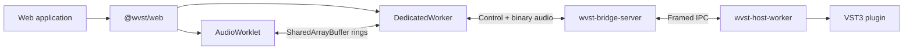

<div align="center">
  
  <h1>WVST</h1>
  <p><strong>Local VST3 processing for real WebAudio graphs.</strong></p>
  <p>
    A Rust-first bridge that keeps browser audio responsive while native plugins run in isolated host workers.
  </p>

  [](https://github.com/backrunner/wvst/actions/workflows/ci.yml)
  
  
  
</div>

> [!IMPORTANT]
> WVST is under active development and does not publish release binaries yet. Build the Bridge Server and host worker from source before using the demo.

WVST connects browser applications to local VST3 effects and instruments. The Web SDK owns browser integration, `wvst-bridge-server` owns authorization and routing, and each third-party plugin runs outside the Bridge in a supervised `wvst-host-worker` process.

## Why WVST

- **Real WebAudio integration** through AudioWorklet, DedicatedWorker, and bounded shared buffers.
- **Crash isolation** because the Bridge Server never loads third-party VST code in-process.
- **Effects and instruments** with audio, MIDI/note events, and sample-offset parameter automation.
- **Observable realtime behavior** including latency, jitter, underflow, overflow, dropped frames, and worker recovery.
- **Explicit security boundaries** with loopback-only defaults, origin checks, and optional token authorization.

## Architecture



The AudioWorklet never blocks on native processing. When a block is late or unavailable, WVST advances the WebAudio clock with an explicit silence/drop policy and records the event in its metrics.

## Quick Start

You need Node.js 22, the Rust toolchain declared in `rust-toolchain.toml`, and a locally installed VST3 plugin.

```sh
npm install
rustup target add wasm32-unknown-unknown
cargo build -p wvst-bridge-server -p wvst-host-worker
```

Start the local Bridge:

```sh
WVST_HOST_WORKER=target/debug/wvst-host-worker \
  cargo run -p wvst-bridge-server -- serve
```

In another terminal, start the cross-origin-isolated documentation site and rack demo:

```sh
npm run docs:dev
```

The Bridge listens on `ws://127.0.0.1:35876` by default. The demo requires `SharedArrayBuffer` and cross-origin isolation; missing low-latency prerequisites are reported instead of silently degraded.

## Repository Map

| Path | Responsibility |
| --- | --- |
| `packages/wvst-web` | TypeScript Web SDK, transport worker, AudioWorklet, sessions, protocol codecs, and metrics |
| `crates/wvst-bridge-server` | Loopback control plane, stream routing, authorization, worker supervision, and diagnostics |
| `crates/wvst-host-worker` | Isolated VST3 lifecycle, control IPC, audio processing, and runtime probing |
| `crates/wvst-vst3-host` | VST3 ABI boundary and safe lifecycle facade |
| `crates/wvst-protocol` | Versioned control and binary audio/event protocols |
| `crates/wvst-shm-*` | Shared-memory layouts, mappings, cursors, and ring transport |
| `crates/wvst-testkit` | Runtime matrices, latency snapshots, stability budgets, and evidence gates |
| `docs` | Svedocs site, bilingual guides, and the live rack demo |

## Development

Run the same core checks used by GitHub Actions:

```sh
cargo fmt --all -- --check
cargo clippy --workspace --all-targets --all-features -- -D warnings
cargo test --workspace
npm run check:wasm
npm run check:web
npm run test:web
npm run build:web:examples
npm run docs:check
npm run docs:build -- --no-og
```

The repository also contains opt-in evidence gates for real VST3 fixtures, browser loopback runs, Bridge-to-plugin smoke tests, stability budgets, and release-package verification. Those workflows require a suitably provisioned self-hosted runner.

## Documentation

- [Overview](docs/content/docs/index.md)
- [Getting started](docs/content/docs/getting-started.md)
- [Architecture](docs/content/docs/architecture.md)
- [Demo guide](docs/content/docs/demo-guide.md)
- [API reference](docs/content/docs/api-reference.md)
- [Troubleshooting](docs/content/docs/troubleshooting.md)
- [中文文档](docs/content/docs/zh/index.md)

For engineering constraints and current implementation gaps, see the [agent documentation map](.agents/README.md).
