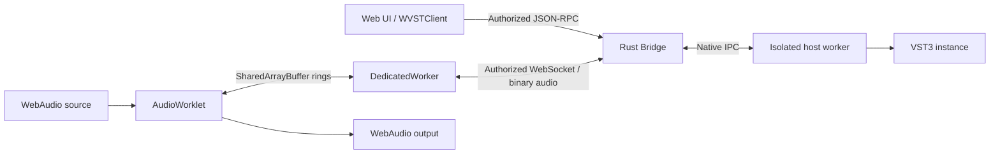

<div align="center">
  <picture>
    <source media="(prefers-color-scheme: dark)" srcset="docs/static/brand/wvst-logo-dark.svg">
    
  </picture>
  <p><strong>Local VST3 processing for real WebAudio graphs.</strong></p>
  <p>A Rust bridge, isolated native plugins, and a browser you can build on.</p>

  [](https://github.com/backrunner/wvst/actions/workflows/ci.yml)
  
  
  

  English · [简体中文](README.zh-CN.md)
</div>

WVST connects a WebAudio graph to VST3 effects and instruments installed on the same computer. Build your interface in the browser; the Rust Bridge handles authorization, plugin discovery and routing, and supervises a separate native host worker for each instance.

**Current stage:** alpha previews, macOS first. Preview artifacts are managed through [GitHub Releases](https://github.com/backrunner/wvst/releases); drafts remain private until published. Source builds remain available. The SDK uses a release tarball rather than npm registry publication.

## What you can do

- Process browser audio through local VST3 effects with AudioWorklet and shared buffers.
- Drive instrument instances with MIDI notes, controllers and sample-offset events through the SDK.
- Create independent instances of the same plugin, edit normalized parameters and save opaque plugin state.
- Observe queue pressure, transport failures, plugin latency and worker recovery through separate diagnostic APIs.
- Build generic browser parameter controls while native processing stays in supervised worker processes.

The **Live Studio** demo provides a local file player, an eight-second generated synth loop, waveform previews, a reorderable stereo effect rack, bypass controls and real output meters. It supports original-audio preview before Bridge connection. VST processing requires the real Bridge and an installed compatible plugin.

## Requirements and scope

| Component | What to use |
| --- | --- |
| Native runtime | macOS is the first target; use a plugin build matching the host worker's CPU architecture. Windows/Linux abstractions do not establish equivalent plugin compatibility. |
| Toolchain | Stable Rust from `rust-toolchain.toml` (workspace minimum 1.85), Node.js 22 and npm. On macOS, install Xcode Command Line Tools for the native linker. |
| Browser | Start with current desktop Chromium. The live path requires a secure context, AudioWorklet, SharedArrayBuffer and cross-origin isolation. |
| Plugin | Install a VST3 effect locally; a stereo 2-in/2-out effect is the simplest Studio fixture. Plugins are not bundled. |

VST2, AU, AAX and CLAP are outside the current scope. Native plugin editors are not embedded in the webpage. Instrument APIs exist, while the Studio UI focuses on effects. There is no fixed or zero-latency guarantee: results depend on the browser, buffers, machine and plugin.

## Quick start

Run these commands from a local checkout:

```sh
git clone https://github.com/backrunner/wvst.git
cd wvst
npm ci
cargo build -p wvst-bridge-server -p wvst-host-worker
```

In terminal A, start the Bridge with an explicit worker path and a development token:

```sh
WVST_TOKEN=local-dev-token \
WVST_HOST_WORKER=target/debug/wvst-host-worker \
  target/debug/wvst-bridge-server serve
```

Keep this process running. Expect `wvst-bridge-server listening on ws://127.0.0.1:35876`. The standalone CLI requires a nonempty `WVST_TOKEN`; `local-dev-token` is an example for local development.

In terminal B:

```sh
npm run docs:dev
```

Open the URL printed by the dev server (normally `http://localhost:5173`) and navigate to `/demo` or `/zh/demo`:

1. Open **Advanced connection settings**, enter `local-dev-token`, then connect to `ws://127.0.0.1:35876`.
2. Choose **Try a synth loop** or drop a local audio file.
3. Select a compatible VST3 effect, mount it and press Play.
4. Adjust parameters, toggle bypass and inspect **Processing details**. With no active effect, the signal path is original audio.

The page initially attempts a connection without a token; an authorization error before you enter the token is expected. The docs server supplies the required COOP/COEP headers. A plain static file server may not.

On macOS, scan locations include `/Library/Audio/Plug-Ins/VST3` and `~/Library/Audio/Plug-Ins/VST3`. If nothing appears, rescan and inspect the reported failures. For startup problems:

```sh
WVST_HOST_WORKER=target/debug/wvst-host-worker \
  target/debug/wvst-bridge-server diagnose
```

See [Getting started](docs/content/docs/getting-started.md) and [Troubleshooting](docs/content/docs/troubleshooting.md) for checkpoints and recovery steps.

## Integrate the SDK

Use `@wvst/web` through the workspace after `npm run build:web`. Worker imports below use Vite conventions; other bundlers need equivalent worker and asset handling.

```ts
import { WVSTClient } from '@wvst/web';

const client = await WVSTClient.connect({
  endpoint: 'ws://127.0.0.1:35876',
  token: 'local-dev-token',
  requireLowLatency: true
});
try {
  const report = await client.plugins.list({ rescan: true });
  console.table(report.plugins.map(({ name, pluginId }) => ({ name, pluginId })));
  console.table(report.failures);
} finally {
  client.close();
}
```

This establishes control access. Audio also needs an authenticated transport worker, a started instance, shared buffers and an AudioWorklet node. The [Web integration guide](docs/content/docs/web-integration.md) covers setup and teardown together; the [API reference](docs/content/docs/api-reference.md) covers parameters, state, MIDI and diagnostics.

For the smaller developer examples:

```sh
npm run example:web:effect
# Or, in a separate run:
npm run example:web:instrument
```

Use the URLs printed by each command and the same running Bridge/token. These examples and the Studio exercise different UI workflows.

## How audio moves



The AudioWorklet keeps the audio clock moving without waiting for native processing. The transport worker handles networking. Missing output causes silence and a counter increment. Worker supervision isolates plugin crashes from the Bridge; applications still need to handle recovery and clean up their own graphs.

## Repository map

| Path | Responsibility |
| --- | --- |
| `packages/wvst-web` | TypeScript SDK, transport worker, AudioWorklet, sessions, codecs and metrics |
| `packages/wvst-web-examples` | Minimal effect and instrument applications |
| `crates/wvst-bridge-server` | Authorization, scanning, instance registry, routing and supervision |
| `crates/wvst-host-worker`, `crates/wvst-vst3-host` | Native plugin lifecycle and VST3 ABI boundary |
| `crates/wvst-core`, `crates/wvst-protocol` | Shared types and versioned control/audio protocols |
| `crates/wvst-ringbuf`, `crates/wvst-shm-*` | Ring buffers, native memory mappings and transport |
| `crates/wvst-process-supervision`, `crates/wvst-embed` | Worker process policies and embedded runtime |
| `crates/wvst-web-wasm` | Rust-to-WASM protocol support |
| `crates/wvst-testkit`, `crates/wvst-packager` | Runtime evidence, stability budgets and packaging tooling |
| `docs` | Bilingual Svedocs site, custom theme, brand and Live Studio |

## Development and validation

Install the WASM target before the full check:

```sh
rustup target add wasm32-unknown-unknown
npm run check
cargo fmt --all -- --check
cargo clippy --workspace --all-targets --all-features -- -D warnings
npm run docs:check
npm run docs:build
```

`npm run check` runs Rust tests, the WASM target check, Web SDK type checks/tests and example type checks. Documentation checks/builds are separate. `npm run docs:build -- --no-og` skips OG generation when only the site build is needed.

Studio browser regression uses a protocol fixture and Chromium; setup is in [docs/README.md](docs/README.md). Fixture success establishes UI/protocol behavior, not third-party plugin compatibility. Real-plugin and sustained-audio evidence workflows require installed fixtures and a provisioned machine; see [Development](docs/content/docs/development.md).

For a contribution, describe the user-visible problem, make a focused change, run the relevant checks and include platform/plugin details for audio issues. Keep realtime code bounded and non-blocking; consult [engineering standards](.agents/development-standards.md) and [implementation gaps](.agents/implementation-gap-analysis.md) before changing runtime boundaries.

Live site: [Documentation](https://wvst-docs.pages.dev/docs) · [Live Studio](https://wvst-docs.pages.dev/demo).

## Documentation

| Guide | English | 简体中文 |
| --- | --- | --- |
| Overview | [Read](docs/content/docs/index.md) | [阅读](docs/content/docs/zh/index.md) |
| Getting started | [Read](docs/content/docs/getting-started.md) | [阅读](docs/content/docs/zh/getting-started.md) |
| Live Studio | [Read](docs/content/docs/demo-guide.md) | [阅读](docs/content/docs/zh/demo-guide.md) |
| Web integration | [Read](docs/content/docs/web-integration.md) | [阅读](docs/content/docs/zh/web-integration.md) |
| API reference | [Read](docs/content/docs/api-reference.md) | [阅读](docs/content/docs/zh/api-reference.md) |
| Architecture | [Read](docs/content/docs/architecture.md) | [阅读](docs/content/docs/zh/architecture.md) |
| Configuration and deployment | [Read](docs/content/docs/configuration.md) | [阅读](docs/content/docs/zh/configuration.md) |
| Troubleshooting | [Read](docs/content/docs/troubleshooting.md) | [阅读](docs/content/docs/zh/troubleshooting.md) |
| Development | [Read](docs/content/docs/development.md) | [阅读](docs/content/docs/zh/development.md) |

Workspace Cargo metadata declares `MIT OR Apache-2.0`. Third-party plugins retain their own licenses. VST is a trademark of Steinberg Media Technologies GmbH.

[](https://github.com/backrunner/wvst/releases)

## Version management

Product versions are synchronized from `Cargo.toml`; wire/schema versions are
independent. [CHANGELOG.md](CHANGELOG.md) records changes. Before preparing a
version, add user-facing changes under Unreleased, then run:

```sh
npm run release:check
npm run release:prepare -- 0.1.0-alpha.2 --date 2026-09-08
npm run release:check -- --tag v0.1.0-alpha.2
```

Use the actual next version/date. Review and push the version commit, pass CI,
then push an annotated `vVERSION` tag. The release workflow produces four native
portable archives, an SDK tarball, SHA256SUMS and a source manifest in a draft
prerelease. Published assets are immutable. See the [release guide](docs/content/docs/releases.md)
for verification, upgrade/rollback and the additional gates needed for stable
releases. The workflow does not publish to npm or crates.io.
