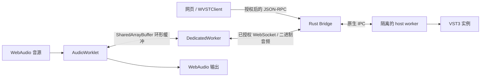

<div align="center">
  <picture>
    <source media="(prefers-color-scheme: dark)" srcset="docs/static/brand/wvst-logo-dark.svg">
    
  </picture>
  <p><strong>让本地 VST3 插件接入真实的 WebAudio 音频链路。</strong></p>
  <p>Rust 本地桥接、独立插件进程，以及可以自由构建的浏览器界面。</p>

  [English](README.md) · 简体中文
</div>

WVST 把浏览器的 WebAudio 音频图连接到同一台电脑上的 VST3 效果器和音源。网页负责交互，Rust Bridge 负责授权、扫描和路由，每个插件实例由独立的 host worker 进程运行和监督。

**当前状态：源码构建，macOS 优先。** 目前没有已发布的二进制安装包，`@wvst/web` 也是私有 workspace 包。建议先跑通仓库内的 Live Studio，再接入自己的应用。

## 能做什么

- 使用 AudioWorklet 和共享缓冲，把浏览器音频送入本地 VST3 效果器。
- 通过 SDK 用 MIDI 音符、控制器和带采样偏移的事件驱动音源实例。
- 为同一插件创建独立实例，编辑归一化参数，保存和恢复插件状态。
- 通过诊断接口观察队列压力、传输失败、插件延迟和 worker 恢复。
- 在浏览器中构建通用参数面板，让原生处理留在受监督的进程中。

**Live Studio** 提供本地文件播放、现场生成的八秒合成器循环、波形预览、可排序的立体声效果链、旁路和真实输出电平。连接 Bridge 前可以试听原音；VST 处理需要真实 Bridge 和已安装的兼容插件。

## 环境与范围

| 组件 | 要求 |
| --- | --- |
| 原生运行时 | macOS 为首要目标；插件与 host worker 的 CPU 架构需要匹配。Windows/Linux 的平台抽象不代表已经具备同等插件兼容性。 |
| 工具链 | `rust-toolchain.toml` 指定的 stable Rust（workspace 最低 1.85）、Node.js 22、npm。macOS 需要 Xcode Command Line Tools 提供链接工具。 |
| 浏览器 | 建议先用当前桌面 Chromium；实时路径需要安全上下文、AudioWorklet、SharedArrayBuffer 和跨源隔离。 |
| 插件 | 本机安装 VST3；首次尝试选择双声道输入、双声道输出的效果器。仓库不附带第三方插件。 |

当前范围不包含 VST2、AU、AAX、CLAP，也不把插件原生编辑器嵌入网页。SDK 提供音源接口，Studio 界面则以效果器为主。实际延迟取决于浏览器、缓冲、电脑和插件，没有固定毫秒数或零延迟保证。

## 快速运行

获取仓库并安装依赖：

```sh
git clone https://github.com/backrunner/wvst.git
cd wvst
npm ci
cargo build -p wvst-bridge-server -p wvst-host-worker
```

终端 A：指定 worker 并启动 Bridge。

```sh
WVST_TOKEN=local-dev-token \
WVST_HOST_WORKER=target/debug/wvst-host-worker \
  target/debug/wvst-bridge-server serve
```

保持进程运行，成功时会显示 `wvst-bridge-server listening on ws://127.0.0.1:35876`。独立 CLI 要求非空 `WVST_TOKEN`；这里的 `local-dev-token` 仅作为本地开发示例。

终端 B：

```sh
npm run docs:dev
```

打开开发服务器输出的地址（通常为 `http://localhost:5173`），进入 `/zh/demo`：

1. 展开高级连接设置，填写 `local-dev-token`，连接 `ws://127.0.0.1:35876`。
2. 试听内置合成器循环，或拖入本地音频文件。
3. 选择兼容的 VST3 效果器，挂载后点击播放。
4. 调整参数、切换旁路，在处理详情中查看指标。没有启用效果器时播放原音。

页面首次加载会尝试不带 token 连接；填写 token 前出现授权错误是预期行为。文档开发服务器已提供 COOP/COEP 响应头，普通静态文件服务器未必提供。

macOS 默认扫描位置包括 `/Library/Audio/Plug-Ins/VST3` 和 `~/Library/Audio/Plug-Ins/VST3`。列表为空时重新扫描并查看失败原因。启动有问题时运行：

```sh
WVST_HOST_WORKER=target/debug/wvst-host-worker \
  target/debug/wvst-bridge-server diagnose
```

完整检查点见[快速开始](docs/content/docs/zh/getting-started.md)和[故障排查](docs/content/docs/zh/troubleshooting.md)。

## 接入 SDK

执行 `npm run build:web` 后，在 workspace 中使用 `@wvst/web`。以下示例建立控制连接，列出插件并释放连接：

```ts
import { WVSTClient } from '@wvst/web';

const client = await WVSTClient.connect({
  endpoint: 'ws://127.0.0.1:35876',
  token: 'local-dev-token',
  requireLowLatency: true
});
try {
  const report = await client.plugins.list({ rescan: true });
  console.table(report.plugins.map(({ name, pluginId }) => ({ name, pluginId })));
  console.table(report.failures);
} finally {
  client.close();
}
```

音频处理还需要单独授权的传输 Worker、已启动的实例、共享缓冲和 AudioWorklet 节点。[Web 接入指南](docs/content/docs/zh/web-integration.md)包含完整创建与释放过程；[API 参考](docs/content/docs/zh/api-reference.md)说明参数、状态、MIDI 和诊断。

也可以运行更小的开发者示例，使用终端打印的地址和同一个 Bridge/token：

```sh
npm run example:web:effect
# 或单独运行音源示例：
npm run example:web:instrument
```

## 音频如何流动



AudioWorklet 不等待本地处理返回，传输 Worker 负责网络。没有及时收到输出时，音频线程输出静音并增加计数。进程监督把插件崩溃隔离在 Bridge 之外；应用仍需要处理恢复和音频图清理。

## 目录结构

| 路径 | 职责 |
| --- | --- |
| `packages/wvst-web` | TypeScript SDK、Worker、AudioWorklet、会话、编解码和指标 |
| `packages/wvst-web-examples` | 最小效果器与音源应用 |
| `crates/wvst-bridge-server` | 授权、扫描、实例登记、路由和进程监督 |
| `crates/wvst-host-worker`、`crates/wvst-vst3-host` | 原生插件生命周期和 VST3 ABI 边界 |
| `crates/wvst-core`、`crates/wvst-protocol` | 共用类型及版本化控制/音频协议 |
| `crates/wvst-ringbuf`、`crates/wvst-shm-*` | 环形缓冲、原生内存映射与传输 |
| `crates/wvst-process-supervision`、`crates/wvst-embed` | worker 策略与可嵌入运行时 |
| `crates/wvst-web-wasm` | Rust 到 WASM 的协议支持 |
| `crates/wvst-testkit`、`crates/wvst-packager` | 运行证据、稳定性预算与打包工具 |
| `docs` | 双语文档站、主题、品牌素材和 Live Studio |

## 开发与验证

首次完整检查前安装 WASM target：

```sh
rustup target add wasm32-unknown-unknown
npm run check
cargo fmt --all -- --check
cargo clippy --workspace --all-targets --all-features -- -D warnings
npm run docs:check
npm run docs:build
```

`npm run check` 包含 Rust 测试、WASM 检查、Web SDK 类型检查及测试、示例类型检查。文档检查和构建单独运行；只验证页面构建时可用 `npm run docs:build -- --no-og` 跳过 OG 生成。

Studio 浏览器回归使用协议 fixture 和 Chromium，启动方法见 [docs/README.md](docs/README.md)。它验证 UI 和协议行为，不代表第三方插件兼容性或长时间音频稳定性。真实插件证据工作流需要配置好的测试机器，详见[开发与验证](docs/content/docs/zh/development.md)。

贡献时请描述具体问题、保持改动聚焦并运行相关检查；音频问题应附上平台、插件和复现步骤。修改运行时前阅读[开发规范](.agents/development-standards.md)与[实现差距](.agents/implementation-gap-analysis.md)，保持实时路径有界、非阻塞。

## 文档入口

- [概览](docs/content/docs/zh/index.md) · [快速开始](docs/content/docs/zh/getting-started.md)
- [Live Studio 指南](docs/content/docs/zh/demo-guide.md) · [Web 接入](docs/content/docs/zh/web-integration.md)
- [API 参考](docs/content/docs/zh/api-reference.md) · [架构](docs/content/docs/zh/architecture.md)
- [配置与部署](docs/content/docs/zh/configuration.md) · [故障排查](docs/content/docs/zh/troubleshooting.md)
- [开发与验证](docs/content/docs/zh/development.md) · [英文文档](docs/content/docs/index.md)

Workspace 的 Cargo 元数据声明许可为 `MIT OR Apache-2.0`；第三方插件遵循各自许可。VST 是 Steinberg Media Technologies GmbH 的商标。
