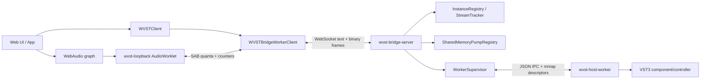

# Architecture

WVST is designed around explicit boundaries. Browser realtime audio stays non-blocking, the Bridge Server owns native process supervision, and third-party VST3 code only runs inside host worker processes.



## Browser Layer

The browser side has three responsibilities.

The UI thread owns user interaction, local media elements, WebAudio graph construction, rack ordering, bypass, parameter UI, and lifecycle cleanup. It can call `WVSTClient` for control requests and `WVSTBridgeWorkerClient` for worker-backed audio stream commands.

The AudioWorklet owns realtime input/output. `loopback-processor` reads input samples into a SharedArrayBuffer-backed ring, reads processed output samples from another ring, and updates counters. It does not fetch, open sockets, parse JSON, allocate large structures, or wait on the Bridge.

The DedicatedWorker owns the browser transport. It connects the WebSocket, polls the SharedArrayBuffer quanta, encodes WVST binary audio frames, sends MIDI/parameter automation events, receives processed frames, and writes output quanta back for the AudioWorklet.

## Bridge Layer

`wvst-bridge-server` accepts loopback WebSocket connections and handles two message classes:

- Text JSON-RPC control requests.
- Binary WVST audio frames.

A client must complete `bridge.hello` before other control methods are accepted. The Bridge checks token/origin policy, negotiates protocol/audio-frame versions, and returns current Bridge metrics.

Important Bridge-owned state:

- `PluginRegistry`: cached scan report and lookup by `pluginId`.
- `InstanceRegistry`: instance descriptors, stream ids, lifecycle state, worker state, runtime capabilities, latency, tail, and stream state.
- `AudioStreamTracker`: sequence, jitter, latency, duplicates, out-of-order frames, late frames, backpressure, and unmatched stream tracking.
- `SharedMemoryStreamRegistry`: file-backed shared-memory descriptor and ring status for an instance.
- `SharedMemoryPumpRegistry`: scheduled worker-side process pump, event queue, adaptive timing, and pump metrics.
- `WorkerSupervisor`: host worker process start/stop/restart, failure accounting, resource limits, and quarantine.
- `BridgeEventBus`: recent events and live `bridge.event` notifications.

## Host Worker Layer

The host worker is the only process that loads VST3 plugins. It receives worker IPC from the Bridge and calls the `wvst-vst3-host` facade.

The worker reports runtime capabilities such as:

- `binaryAudioProcess`
- `componentState`
- `controller`
- `controllerState`
- `parameters`
- `parameterAutomation`
- `units`
- `unitProgramData`
- `programListData`
- `unitData`
- `midiMapping`
- `outputEvents`
- `outputParameterChanges`
- `componentHandlerEvents`
- `connectionPoints`
- `processContext`

If a capability is unavailable, the worker can attach diagnostics with a capability name, reason, message, and hint.

## Instance Lifecycle

An instance descriptor includes both app-facing identity and runtime state:

```ts
interface InstanceDescriptor {
  instanceId: number;
  streamId: number;
  pluginId: string;
  pluginPath: string;
  classId?: string;
  sampleRate: number;
  maxBlockFrames: number;
  inputChannels: number;
  outputChannels: number;
  state: "allocated" | "starting" | "ready" | "processing" | "stopping" | "stopped" | "recovering" | "failed";
  workerState: "not-started" | "starting" | "ready" | "processing" | "stopping" | "stopped" | "recovering" | "failed";
  streamState: "open" | "closed";
  latencySamples: number;
  tailSamples: number;
  tailInfo: { samples: number; kind: "none" | "finite" | "infinite" };
}
```

Typical flow:

1. `plugin.scan` or `plugin.list`.
2. `instance.create` with `sampleRate`, `maxBlockFrames`, `inputChannels`, and `outputChannels`.
3. `stream.open` if it was closed.
4. `instance.start`.
5. Audio data through browser binary frames or Bridge shared-memory processing.
6. `instance.stop`, `stream.close`, and `instance.destroy`.

The docs live rack creates one WVST instance per slot. WebAudio serially chains each slot's AudioWorklet node; WVST keeps every instance and stream independent.

## Control Plane

Control requests are JSON-RPC shaped:

```json
{
  "jsonrpc": "2.0",
  "id": 12,
  "method": "instance.parameter.edit",
  "params": {
    "instanceId": 7,
    "parameterId": 100,
    "valueNormalized": 0.5
  }
}
```

The Bridge returns either `result` or `error`. `WVSTBridgeError` exposes the numeric code, message, and optional structured data.

`WVSTClient` wraps the control methods so app code can stay typed. It also exposes:

- `metrics()`: Bridge metrics snapshot.
- `events({ afterSequence })`: recent event polling.
- `onEvent(listener)`: live event notifications pushed from the Bridge WebSocket.
- `refreshMetadataForInvalidation(event, options)`: refresh parameters/units/state after VST3 component handler invalidation events.

## Binary Audio Frame

The WebSocket data plane uses versioned binary frames:

- Magic: `AUDIO_FRAME_MAGIC`
- Version: `AUDIO_FRAME_VERSION`
- Header bytes: `AUDIO_FRAME_HEADER_BYTES`
- Format: `AudioSampleFormat.F32Le`
- Flags: silence, MIDI-only, end-of-stream, late, process-error
- Sections: interleaved f32 audio, fixed-size MIDI events, fixed-size parameter automation events, fixed-size VST3 output events

The current protocol exports codecs for all sections:

```ts
encodeAudioFrame(header, audioPayload, midiEvents, parameterEvents, outputEvents);
decodeAudioFrame(frame);
```

MIDI events and parameter automation include `sampleOffset`, so events can be applied inside a block instead of only at block boundaries.

## AudioWorklet Loopback Path

`createLoopbackSharedBuffers()` allocates the browser-side SharedArrayBuffers:

- Input audio ring.
- Output audio ring.
- Counter buffer.

`configureLoopbackAudioWorkletNode()` posts those buffers to `wvst-loopback`. `readLoopbackMetrics()` reads counters:

- `inputFrames`, `outputFrames`
- `underflows`, `overflows`
- `droppedInputQuanta`, `droppedOutputQuanta`
- `droppedMidiEvents`, `droppedParameterEvents`
- `lateMidiEvents`, `lateParameterEvents`
- `transportFailures`
- pending input/output quanta

This path is appropriate for WebAudio graph integration and the live demo.

## Bridge Shared-Memory Pump Path

The Bridge also exposes file-backed shared-memory transport:

1. `stream.sharedMemory.create`
2. `stream.sharedMemory.pump.start`
3. `stream.sharedMemory.pump.enqueueEvents`
4. `stream.sharedMemory.pump.status`
5. `stream.sharedMemory.pump.stop`
6. `stream.sharedMemory.destroy`

`createWVSTSharedMemoryPumpSession()` wraps that lifecycle. The pump supports fixed or adaptive scheduling, pending event queues, late/dropped event accounting, input underrun and output backpressure status, process latency, and last error reporting.

This path is useful for diagnostics, packaged local integrations, and non-WebAudio test harnesses.

## Parameters, Units, Programs, and State

Current instance APIs include:

- Parameter metadata: `instance.parameters`, `instance.parameter.info`.
- Values: `instance.parameter.get`, `instance.parameter.set`.
- Text/plain conversions: `instance.parameter.valueByString`, `instance.parameter.normalizedByPlain`.
- Gesture-safe editing: `beginEdit`, `performEdit`, `endEdit`, or aggregate `parameterEdit`.
- Unit metadata: `instance.units`, `instance.selectUnit`, `instance.unitByBus`.
- Program and unit data: `programData.get/set`, `unitData.get/set`, `setUnitProgramData`.
- Opaque state: `instance.getState`, `instance.setState`, `instance.state.setAndRefresh`.

The Web SDK snapshot helper stores component/controller state as base64 and checks plugin/class/sample-rate/block-size/channel compatibility before restore.

## MIDI and Instruments

MIDI support is represented in the protocol and Web SDK:

- `MidiEventKind.NoteOn`
- `NoteOff`
- `ControlChange`
- `PitchBend`
- `ChannelAftertouch`
- `PolyAftertouch`
- `RawMidi`

`createWVSTVirtualKeyboard()` creates note, CC, pitch bend, channel aftertouch, and poly aftertouch events. `createWVSTWebMidiAdapter()` converts browser Web MIDI messages and can optionally pass unknown messages as raw MIDI.

Instrument plugins can use `inputChannels: 0` while still producing output. AudioWorklet node creation handles no-input instances by creating zero input buses and one output bus.

## Events, Recovery, and Quarantine

Bridge events include server lifecycle, worker lifecycle, stream lifecycle, worker failures, recovery, quarantine, policy decisions, component handler events, lost component handler events, and VST3 metadata invalidation.

Worker recovery has two visible modes:

- `manual-restart`
- `auto-heartbeat`

When repeated worker failures hit the configured threshold, the plugin can be quarantined to prevent restart storms. Quarantine events include failure counts and release timing.

The Web device session helper can watch loopback `transportFailures`, auto-restart audio streams, report restart failures, and flag sample-rate mismatches that require graph rebuild.

## Observability

Bridge metrics include:

- WebSocket/control/binary frame counts.
- Audio frames routed and route failures.
- Invalid headers/lengths and unmatched streams.
- Sequence gaps, duplicate/out-of-order/late frames, and backpressure drops.
- Worker failures, restarts, auto-restarts, shutdown/kill/wait counters.
- Shared-memory process frames, failures, latency histogram.
- Shared-memory pump preflight skips, overruns, underruns, output backpressure, worker errors, event queue stats.
- Latency histograms for route latency, interarrival jitter, and shared-memory process latency.

`instance.runtime.snapshot` combines instance descriptor, metadata refresh result, shared-memory status, pump status, and optional recent events.

## Two connections and latency boundaries

Studio's main-thread `WVSTClient` owns control while the DedicatedWorker owns a separate audio socket. Both need `bridge.hello`; authorization on one does not authorize the other. Browser SABs and native file-mapped shared memory are separate data planes, not direct browser access to plugin memory.

At 48 kHz, 128 frames represent about 2.67 ms of audio, not an entire round trip. Ring capacity is not fixed delay either. Actual round-trip time includes browser scheduling, transport, Bridge routing, plugin processing and output queues. Plugin `latencySamples` describes only plugin-declared delay; end-to-end claims require loopback measurement.

See [Web integration](/docs/web-integration) for creation/cleanup order, [Configuration and deployment](/docs/configuration) for setup and [Development](/docs/development) for validation.
