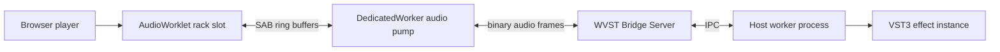

# Architecture

WVST keeps realtime browser audio and native plugin hosting separated by explicit process and thread boundaries.

## Boundaries

- The Web UI owns user interaction, local file playback, rack ordering, bypass state, and generic control surfaces.
- The AudioWorklet only reads/writes bounded audio buffers and never performs network, filesystem, JSON, logging, or async work in `process()`.
- The DedicatedWorker owns WebSocket transport and converts SAB quanta to WVST binary audio frames.
- The Bridge Server handles control requests, stream routing, metrics, origin/token checks, and host worker lifecycle.
- Each VST instance runs in an isolated host worker process so plugin failure does not crash the bridge or browser.

## Rack model

The first demo treats each rack slot as an independent WVST instance. WebAudio serially connects slot worklet nodes, while WVST keeps instance state and stream IDs independent.
