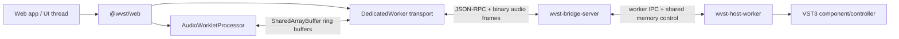

# Overview

WVST is a Rust-first bridge between browser audio graphs and local VST3 plugins. A web app talks to a loopback Bridge Server, the Bridge Server supervises native host worker processes, and the browser keeps realtime audio moving through AudioWorklet and bounded shared buffers.

The current repository is no longer just a skeleton. It contains:

- `@wvst/web`: TypeScript SDK exports for Bridge connection, plugin scan/list/factory metadata, instance lifecycle, parameter editing, unit/program/state helpers, MIDI adapters, device sessions, loopback AudioWorklet helpers, shared-memory transport helpers, protocol codecs, and metrics.
- `wvst-bridge-server`: localhost WebSocket control plane, binary frame routing, event streaming, bridge metrics, origin/token authorization, stream lifecycle, shared-memory stream/pump control, worker supervision, quarantine, and diagnostics.
- `wvst-host-worker`: isolated process boundary for VST3 runtime probing, instance lifecycle, control IPC, shared-memory attach/process calls, MIDI/parameter event forwarding, and runtime capability reporting.
- `wvst-vst3-host`: safe facade over VST3 loading, component/controller lifecycle, parameter metadata, units/program lists, state, bus selection, process output, component handler events, connection points, MIDI mapping, and process context.
- `wvst-testkit` and packager tooling: runtime matrices, latency/stability budgets, WebAudio loopback metrics, Bridge metrics ingestion, and package evidence checks.

## Current Scope

The code supports effect and instrument-oriented primitives, but the docs live demo intentionally focuses on a browser-side effect rack:

1. Load a local audio file into the browser.
2. Connect to `wvst-bridge-server` at `ws://127.0.0.1:35876`.
3. Scan or list local VST3 metadata.
4. Create one WVST instance per rack slot.
5. Start each instance and connect it to an AudioWorklet node.
6. Route AudioWorklet input/output through a DedicatedWorker and Bridge binary audio frames.
7. Display loopback metrics such as pending quanta, underflow, overflow, dropped events, and transport failures.

There is no mock audio fallback in the demo. Missing `SharedArrayBuffer`, missing cross-origin isolation, an unavailable Bridge, or an unavailable VST3 plugin is shown as an explicit failure.

## Runtime Model



The Bridge Server never loads third-party VST code directly. It creates or supervises host worker processes, tracks stream state, applies recovery policy, and exposes structured control responses.

The AudioWorklet never waits for native plugin processing. It only reads and writes bounded audio buffers, increments counters, and emits silence/drops when data is not ready.

## Public Web SDK Surface

Most app code starts with these exports:

```ts
import {
  WVSTClient,
  WVSTBridgeWorkerClient,
  configureLoopbackAudioWorkletNode,
  createLoopbackSharedBuffers,
  readLoopbackMetrics
} from "@wvst/web";
```

The package also exports:

- `createWVSTAudioDeviceSession()` for microphone/device input to WVST and routed output.
- `createWVSTSharedMemoryPumpSession()` for Bridge-managed file-backed shared memory processing.
- `createWVSTVirtualKeyboard()` and `createWVSTWebMidiAdapter()` for note, CC, pitch bend, aftertouch, and raw MIDI input.
- `createWVSTInstanceStateSnapshot()` and `instanceStateSnapshotToSetStateOptions()` for opaque VST3 state persistence.
- Protocol helpers such as `encodeAudioFrame()`, `decodeAudioFrame()`, `encodeVst3OutputEvent()`, and `decodeVst3OutputEventPayloadText()`.

## Control Plane Highlights

The Bridge uses JSON-RPC style messages over WebSocket. `WVSTClient` maps TypeScript methods to Bridge methods:

- Bridge: `bridge.hello`, `bridge.metrics`, `bridge.events`.
- Plugins: `plugin.scan`, `plugin.list`, `plugin.factoryInfo`.
- Instances: `instance.create`, `instance.list`, `instance.status`, `instance.start`, `instance.stop`, `instance.restart`, `instance.destroy`.
- Runtime metadata: `instance.parameters`, `instance.parameter.get`, `instance.parameter.info`, `instance.units`, `instance.metadata.refresh`, `instance.runtime.snapshot`.
- Editing and state: `instance.parameter.beginEdit`, `instance.parameter.performEdit`, `instance.parameter.endEdit`, `instance.parameter.edit`, `instance.getState`, `instance.setState`, `instance.state.setAndRefresh`.
- VST3 units and programs: `instance.selectUnit`, `instance.unitByBus`, `instance.setUnitProgramData`, `instance.programData.get`, `instance.programData.set`, `instance.unitData.get`, `instance.unitData.set`.
- Streams: `stream.open`, `stream.close`, `stream.sharedMemory.create`, `stream.sharedMemory.process`, `stream.sharedMemory.pump.start`, `stream.sharedMemory.pump.enqueueEvents`, `stream.sharedMemory.pump.status`.

## Safety Defaults

- Bridge defaults to loopback: `127.0.0.1:35876`.
- Loopback browser origins are allowed by default for development.
- `WVST_TOKEN` can require a token in the `bridge.hello` handshake.
- `WVST_ALLOWED_ORIGINS` can restrict accepted browser origins.
- Worker auto-restart and quarantine are enabled by default.
- Low-latency browser mode requires `SharedArrayBuffer` and `crossOriginIsolated`.

## Read Next

- [Getting Started](/docs/getting-started)
- [Architecture](/docs/architecture)
- [Live Demo](/docs/live-demo)
- [Troubleshooting](/docs/troubleshooting)
