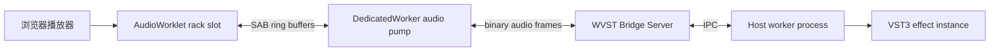

# 架构

WVST 通过明确的进程和线程边界，把浏览器实时音频与原生插件宿主隔开。

## 边界

- Web UI 负责用户交互、本地文件播放、rack 排序、bypass 状态和通用控制界面。
- AudioWorklet 只读写有界音频缓冲，不在 `process()` 中做网络、文件、JSON、日志或 async 工作。
- DedicatedWorker 持有 WebSocket transport，并把 SAB quantum 编码为 WVST 二进制音频帧。
- Bridge Server 处理控制请求、stream routing、metrics、origin/token 校验和 host worker 生命周期。
- 每个 VST 实例运行在隔离 host worker 进程中，插件失败不会杀掉 bridge 或浏览器。

## Rack 模型

第一版 demo 把每个 rack slot 当成一个独立 WVST 实例。WebAudio 串联 slot worklet node，WVST 则保持每个实例独立的状态和 stream id。
