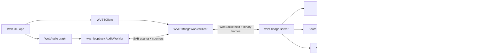

# 架构

WVST 的核心是清晰边界：浏览器实时音频不阻塞，Bridge Server 管理原生进程，第三方 VST3 代码只在 host worker 进程中运行。



## 浏览器层

浏览器侧有三类职责。

UI thread 负责用户交互、本地 media element、WebAudio graph 构建、rack 排序、bypass、参数 UI 和 lifecycle cleanup。它可以用 `WVSTClient` 发控制请求，也可以用 `WVSTBridgeWorkerClient` 控制 worker-backed audio stream。

AudioWorklet 负责实时输入/输出。`loopback-processor` 把输入样本写到 SharedArrayBuffer ring，从另一个 ring 读取处理后的输出样本，并更新 counters。它不 fetch、不开 socket、不解析 JSON、不做大对象分配，也不等待 Bridge。

DedicatedWorker 负责浏览器 transport。它连接 WebSocket，轮询 SharedArrayBuffer quanta，编码 WVST binary audio frame，发送 MIDI/parameter automation events，接收处理后的 frame，再把输出 quanta 写回 AudioWorklet 使用的 ring。

## Bridge 层

`wvst-bridge-server` 接受 loopback WebSocket 连接，并处理两类消息：

- 文本 JSON-RPC 控制请求。
- 二进制 WVST audio frame。

客户端必须先完成 `bridge.hello`，其他控制方法才会被接受。Bridge 会检查 token/origin policy，协商 protocol/audio-frame version，并返回当前 Bridge metrics。

Bridge 持有的重要状态：

- `PluginRegistry`：缓存 scan report，并按 `pluginId` 查找插件。
- `InstanceRegistry`：instance descriptor、stream id、lifecycle state、worker state、runtime capabilities、latency、tail 和 stream state。
- `AudioStreamTracker`：sequence、jitter、latency、duplicate、out-of-order、late frame、backpressure 和 unmatched stream。
- `SharedMemoryStreamRegistry`：实例的 file-backed shared-memory descriptor 和 ring status。
- `SharedMemoryPumpRegistry`：定时 worker-side process pump、event queue、adaptive timing 和 pump metrics。
- `WorkerSupervisor`：host worker 进程启动/停止/重启、failure accounting、resource limits 和 quarantine。
- `BridgeEventBus`：recent events 和实时 `bridge.event` notifications。

## Host Worker 层

host worker 是唯一加载 VST3 插件的进程。它从 Bridge 接收 worker IPC，并调用 `wvst-vst3-host` facade。

worker 会报告 runtime capabilities，例如：

- `binaryAudioProcess`
- `componentState`
- `controller`
- `controllerState`
- `parameters`
- `parameterAutomation`
- `units`
- `unitProgramData`
- `programListData`
- `unitData`
- `midiMapping`
- `outputEvents`
- `outputParameterChanges`
- `componentHandlerEvents`
- `connectionPoints`
- `processContext`

能力不可用时，worker 可以带上 capability、reason、message 和 hint 形式的 diagnostics。

## Instance 生命周期

Instance descriptor 同时包含 app identity 和运行时状态：

```ts
interface InstanceDescriptor {
  instanceId: number;
  streamId: number;
  pluginId: string;
  pluginPath: string;
  classId?: string;
  sampleRate: number;
  maxBlockFrames: number;
  inputChannels: number;
  outputChannels: number;
  state: "allocated" | "starting" | "ready" | "processing" | "stopping" | "stopped" | "recovering" | "failed";
  workerState: "not-started" | "starting" | "ready" | "processing" | "stopping" | "stopped" | "recovering" | "failed";
  streamState: "open" | "closed";
  latencySamples: number;
  tailSamples: number;
  tailInfo: { samples: number; kind: "none" | "finite" | "infinite" };
}
```

常见流程：

1. `plugin.scan` 或 `plugin.list`。
2. 使用 `sampleRate`、`maxBlockFrames`、`inputChannels`、`outputChannels` 调用 `instance.create`。
3. 如果 stream 已关闭，调用 `stream.open`。
4. 调用 `instance.start`。
5. 通过浏览器 binary frames 或 Bridge shared-memory processing 传输音频。
6. 调用 `instance.stop`、`stream.close`、`instance.destroy`。

文档 live rack 每个 slot 创建一个独立 WVST instance。WebAudio 串联各 slot 的 AudioWorklet node；WVST 保持每个 instance 和 stream 独立。

## 控制面

控制请求是 JSON-RPC 形态：

```json
{
  "jsonrpc": "2.0",
  "id": 12,
  "method": "instance.parameter.edit",
  "params": {
    "instanceId": 7,
    "parameterId": 100,
    "valueNormalized": 0.5
  }
}
```

Bridge 返回 `result` 或 `error`。`WVSTBridgeError` 会暴露 numeric code、message 和可选结构化 data。

`WVSTClient` 包装了控制方法，同时提供：

- `metrics()`：Bridge metrics snapshot。
- `events({ afterSequence })`：recent event polling。
- `onEvent(listener)`：Bridge WebSocket 推送的实时事件。
- `refreshMetadataForInvalidation(event, options)`：在 VST3 component handler invalidation 后刷新 parameters/units/state。

## 二进制音频帧

WebSocket 数据面使用 versioned binary frames：

- Magic：`AUDIO_FRAME_MAGIC`
- Version：`AUDIO_FRAME_VERSION`
- Header bytes：`AUDIO_FRAME_HEADER_BYTES`
- Format：`AudioSampleFormat.F32Le`
- Flags：silence、MIDI-only、end-of-stream、late、process-error
- Sections：interleaved f32 audio、固定大小 MIDI events、固定大小 parameter automation events、固定大小 VST3 output events

当前协议导出所有 section 的 codecs：

```ts
encodeAudioFrame(header, audioPayload, midiEvents, parameterEvents, outputEvents);
decodeAudioFrame(frame);
```

MIDI events 和 parameter automation 都带 `sampleOffset`，因此事件可以在 block 内生效，而不是只能卡在 block 边界。

## AudioWorklet Loopback Path

`createLoopbackSharedBuffers()` 分配浏览器侧 SharedArrayBuffers：

- Input audio ring。
- Output audio ring。
- Counter buffer。

`configureLoopbackAudioWorkletNode()` 把 buffers 发送给 `wvst-loopback`。`readLoopbackMetrics()` 读取 counters：

- `inputFrames`、`outputFrames`
- `underflows`、`overflows`
- `droppedInputQuanta`、`droppedOutputQuanta`
- `droppedMidiEvents`、`droppedParameterEvents`
- `lateMidiEvents`、`lateParameterEvents`
- `transportFailures`
- pending input/output quanta

这个路径适合 WebAudio graph 集成和 live demo。

## Bridge Shared-Memory Pump Path

Bridge 也暴露 file-backed shared-memory transport：

1. `stream.sharedMemory.create`
2. `stream.sharedMemory.pump.start`
3. `stream.sharedMemory.pump.enqueueEvents`
4. `stream.sharedMemory.pump.status`
5. `stream.sharedMemory.pump.stop`
6. `stream.sharedMemory.destroy`

`createWVSTSharedMemoryPumpSession()` 会包装这个 lifecycle。pump 支持 fixed/adaptive scheduling、pending event queue、late/dropped event accounting、input underrun、output backpressure、process latency 和 last error。

这个路径适合 diagnostics、打包后的本地集成，以及非 WebAudio test harness。

## 参数、Units、Programs 和 State

当前 instance APIs 包括：

- 参数 metadata：`instance.parameters`、`instance.parameter.info`。
- 参数值：`instance.parameter.get`、`instance.parameter.set`。
- 文本/plain 转换：`instance.parameter.valueByString`、`instance.parameter.normalizedByPlain`。
- 手势友好的编辑流程：`beginEdit`、`performEdit`、`endEdit`，或 aggregate `parameterEdit`。
- Unit metadata：`instance.units`、`instance.selectUnit`、`instance.unitByBus`。
- Program 与 unit data：`programData.get/set`、`unitData.get/set`、`setUnitProgramData`。
- Opaque state：`instance.getState`、`instance.setState`、`instance.state.setAndRefresh`。

Web SDK snapshot helper 会把 component/controller state 存为 base64，并在恢复前检查 plugin/class/sample-rate/block-size/channel 是否兼容。

## MIDI 与 Instrument

MIDI 在协议和 Web SDK 中都有表示：

- `MidiEventKind.NoteOn`
- `NoteOff`
- `ControlChange`
- `PitchBend`
- `ChannelAftertouch`
- `PolyAftertouch`
- `RawMidi`

`createWVSTVirtualKeyboard()` 可以创建 note、CC、pitch bend、channel aftertouch 和 poly aftertouch events。`createWVSTWebMidiAdapter()` 会转换浏览器 Web MIDI message，也可以把有效的 Program Change 和系统短消息作为 raw MIDI 传递；原生输入转换尚未实现这些消息的动作。SysEx、不完整消息和拼接消息会拒绝。

Instrument 插件可以使用 `inputChannels: 0` 并产生输出。AudioWorklet node 创建逻辑支持 no-input instance：输入 bus 数为 0，输出 bus 为 1。

## Events、Recovery 和 Quarantine

Bridge events 包括 server lifecycle、worker lifecycle、stream lifecycle、worker failure、recovery、quarantine、policy decision、component handler event、lost component handler event 和 VST3 metadata invalidation。

worker recovery 有两个可见 mode：

- `manual-restart`
- `auto-heartbeat`

重复 worker failure 达到阈值后，插件会进入 quarantine，避免重启风暴。quarantine event 会包含 failure count 和 release timing。

Web device session helper 可以观察 loopback `transportFailures`，自动重启 audio stream，报告 restart failure，并在 sample-rate mismatch 时标记需要 rebuild graph。

## 可观测性

Bridge metrics 包括：

- WebSocket/control/binary frame 计数。
- routed audio frames 和 route failures。
- invalid headers/lengths 与 unmatched streams。
- sequence gaps、duplicate/out-of-order/late frames 和 backpressure drops。
- worker failures、restarts、auto-restarts、shutdown/kill/wait counters。
- shared-memory process frames、failures、latency histogram。
- shared-memory pump preflight skips、overruns、underruns、output backpressure、worker errors 和 event queue stats。
- route latency、interarrival jitter、shared-memory process latency 的 histogram。

`instance.runtime.snapshot` 会合并 instance descriptor、metadata refresh result、shared-memory status、pump status 和可选 recent events。

## 双连接授权与延迟边界

Studio 的主线程 `WVSTClient` 负责控制，DedicatedWorker 持有独立音频 socket。二者都需要 `bridge.hello`；主线程授权不会隐式授权第二条连接。浏览器 SAB 和原生文件映射共享内存是不同的数据面，不能描述为浏览器直接共享插件内存。

128 帧在 48 kHz 下约为 2.67 ms，这是一个 block 的时间；环形缓冲容量也不等于固定延迟。实际往返包含浏览器调度、传输、Bridge 路由、插件处理和输出排队。插件 `latencySamples` 只说明插件自身声明的延迟，端到端结论需要 loopback 测量。

创建与清理顺序见 [Web 接入](/docs/zh/web-integration)，环境配置见[配置与部署](/docs/zh/configuration)，验证方法见[开发与验证](/docs/zh/development)。
