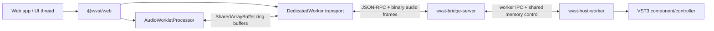

# 概览

WVST 是一个 Rust-first 的 WebAudio/VST3 桥接项目。Web 应用连接本机 loopback Bridge Server；Bridge Server 负责插件发现、worker supervision 和音频路由；浏览器侧用 AudioWorklet 与有界共享缓冲保持实时音频不阻塞。


## 从你的任务开始

| 目标 | 阅读入口 |
| --- | --- |
| 第一次体验本地效果器 | [快速开始](/docs/zh/getting-started)与 [Studio 指南](/docs/zh/demo-guide)。 |
| 把插件接入自己的网页 | [Web 接入](/docs/zh/web-integration)与 [API 参考](/docs/zh/api-reference)。 |
| 配置授权或托管站点 | [配置与部署](/docs/zh/configuration)。 |
| 排查静音、崩溃与延迟 | [故障排查](/docs/zh/troubleshooting)与[架构](/docs/zh/architecture)。 |
| 贡献代码或验证插件兼容性 | [开发与验证](/docs/zh/development)。 |

macOS 优先，可采用源码构建或[发布指南](/docs/zh/releases)中的已公开便携预览包。SDK 在 workspace 内保持 private，也可用 Release tarball 分发。平台抽象、协议 fixture 和真实插件兼容性是不同层次的能力与证据。

Studio 可先播放原音或本机生成的八秒片段。效果处理仍需要 Bridge 和真实 VST3；界面不提供原生插件编辑器、工程保存或渲染导出。

当前仓库已经不只是骨架，主要能力包括：

- `@wvst/web`：Bridge 连接、插件 scan/list/factory metadata、实例生命周期、参数编辑、unit/program/state helper、MIDI adapter、设备 session、loopback AudioWorklet helper、shared-memory transport helper、协议编解码和 metrics。
- `wvst-bridge-server`：localhost WebSocket 控制面、二进制音频 routing、事件流、Bridge metrics、origin/token 授权、stream 生命周期、shared-memory stream/pump 控制、worker supervision、quarantine 和 diagnostics。
- `wvst-host-worker`：VST3 runtime probe、实例生命周期、控制 IPC、shared-memory attach/process、MIDI/parameter event 转发和 runtime capability 上报。
- `wvst-vst3-host`：VST3 加载、component/controller lifecycle、参数 metadata、unit/program list、state、bus selection、process output、component handler event、connection point、MIDI mapping 和 process context 的 safe facade。
- `wvst-testkit` 与打包工具：runtime matrix、latency/stability budget、WebAudio loopback metrics、Bridge metrics ingestion 和 package evidence 检查。

## 当前范围

代码里已经有 effect、instrument 和 MIDI 相关 primitive，但文档 live demo 第一版聚焦浏览器侧 effect rack：

1. 在浏览器中加载本地音频文件。
2. 连接 `ws://127.0.0.1:35876` 上的 `wvst-bridge-server`。
3. 扫描或列出本机 VST3 metadata。
4. 每个 rack slot 创建一个 WVST instance。
5. 启动每个 instance，并连接对应的 AudioWorklet node。
6. 通过 DedicatedWorker 和 Bridge binary audio frame 路由 AudioWorklet 输入/输出。
7. 展示 pending quanta、underflow、overflow、dropped event 和 transport failure 等指标。

demo 不做 mock 音频 fallback。缺少 `SharedArrayBuffer`、cross-origin isolation、Bridge、VST3 插件或 worker/audio stream 失败时，界面会显示明确错误。

## 运行时模型



Bridge Server 不直接加载第三方 VST。它创建或管理 host worker 进程，跟踪 stream state，执行恢复策略，并输出结构化控制响应。

AudioWorklet 不等待 native plugin processing。它只读写有界音频缓冲、更新 counters，并在数据未就绪时产生 silence/drop 状态。

## Web SDK 主要入口

多数应用会从这些导出开始：

```ts
import {
  WVSTClient,
  WVSTBridgeWorkerClient,
  configureLoopbackAudioWorkletNode,
  createLoopbackSharedBuffers,
  readLoopbackMetrics
} from "@wvst/web";
```

SDK 还导出：

- `createWVSTAudioDeviceSession()`：把麦克风/设备输入接入 WVST，并路由到输出设备。
- `createWVSTSharedMemoryPumpSession()`：Bridge 管理的 file-backed shared memory processing。
- `createWVSTVirtualKeyboard()` 与 `createWVSTWebMidiAdapter()`：note、CC、pitch bend、aftertouch 和 raw MIDI 输入。
- `createWVSTInstanceStateSnapshot()` 与 `instanceStateSnapshotToSetStateOptions()`：VST3 opaque state 的持久化和恢复。
- 协议 helper：`encodeAudioFrame()`、`decodeAudioFrame()`、`encodeVst3OutputEvent()`、`decodeVst3OutputEventPayloadText()`。

## 控制面概览

Bridge 使用 WebSocket 上的 JSON-RPC 风格消息。`WVSTClient` 会把 TypeScript 方法映射到 Bridge methods：

- Bridge：`bridge.hello`、`bridge.metrics`、`bridge.events`。
- 插件：`plugin.scan`、`plugin.list`、`plugin.factoryInfo`。
- 实例：`instance.create`、`instance.list`、`instance.status`、`instance.start`、`instance.stop`、`instance.restart`、`instance.destroy`。
- 运行时 metadata：`instance.parameters`、`instance.parameter.get`、`instance.parameter.info`、`instance.units`、`instance.metadata.refresh`、`instance.runtime.snapshot`。
- 编辑和 state：`instance.parameter.beginEdit`、`instance.parameter.performEdit`、`instance.parameter.endEdit`、`instance.parameter.edit`、`instance.getState`、`instance.setState`、`instance.state.setAndRefresh`。
- VST3 units/programs：`instance.selectUnit`、`instance.unitByBus`、`instance.setUnitProgramData`、`instance.programData.get`、`instance.programData.set`、`instance.unitData.get`、`instance.unitData.set`。
- Streams：`stream.open`、`stream.close`、`stream.sharedMemory.create`、`stream.sharedMemory.process`、`stream.sharedMemory.pump.start`、`stream.sharedMemory.pump.enqueueEvents`、`stream.sharedMemory.pump.status`。

## 安全默认值

- Bridge 默认监听 loopback：`127.0.0.1:35876`。
- 开发环境默认允许 loopback browser origins。
- 独立 CLI 要求设置 `WVST_TOKEN`，控制与音频 socket 都必须完成 `bridge.hello` 授权。
- `WVST_ALLOWED_ORIGINS` 可以限制允许的浏览器 origin。
- worker auto-restart 与 quarantine 默认开启。
- 低延迟浏览器模式要求 `SharedArrayBuffer` 和 `crossOriginIsolated`。

## 继续阅读

- [快速开始](/docs/zh/getting-started)
- [架构](/docs/zh/architecture)
- [Demo Guide](/docs/zh/demo-guide)
- [API Reference](/docs/zh/api-reference)
- [故障排查](/docs/zh/troubleshooting)

## 版本管理

[版本与发布](/docs/zh/releases)说明统一产品版本、预览产物、校验、升级回退及维护者发布流程。
